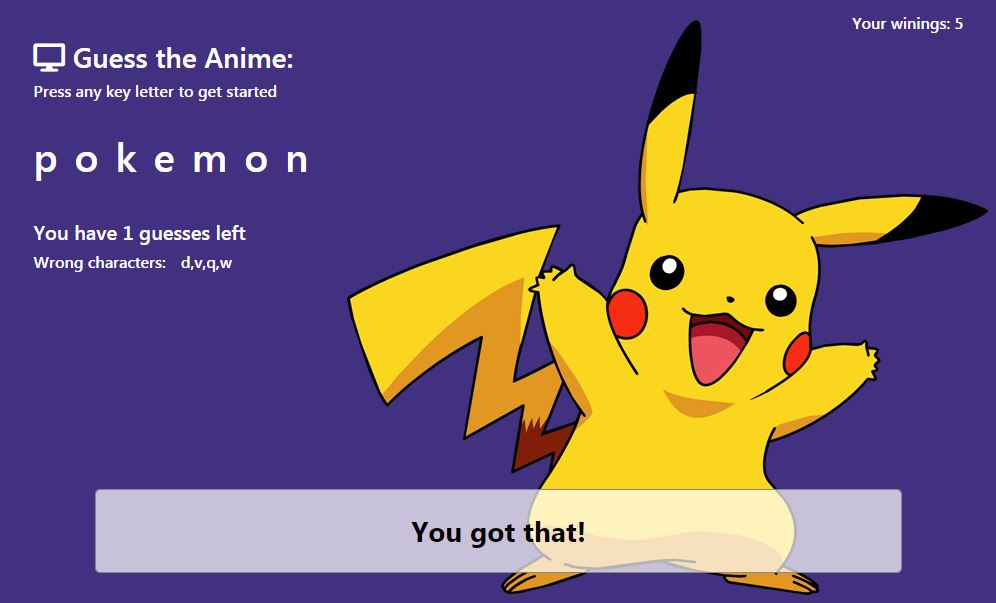

# Anime Guessing Game

### Overview
This project is a word guess game where the user is guessing Anime shows. The inspiration for the style came from AnimeLab.com website.

### How does it work?
The game gives the user a blanked Anime show and the user needs to guess the word.
The user guess one character at the time. If the user guess 5 wrong characters - the user lost. If the user guess all characters of the Anime show the game gives a new word.

### Why does it useful?
This is a great example for a basic game that has some dialog with the user. Most of the function are console.loging through the game and gives a glance at what is happening in the code.

### How do the user play?
The game will start as soon as the user opens the HTML page. Instruction is on the page.
